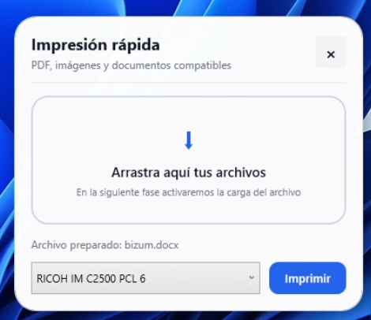
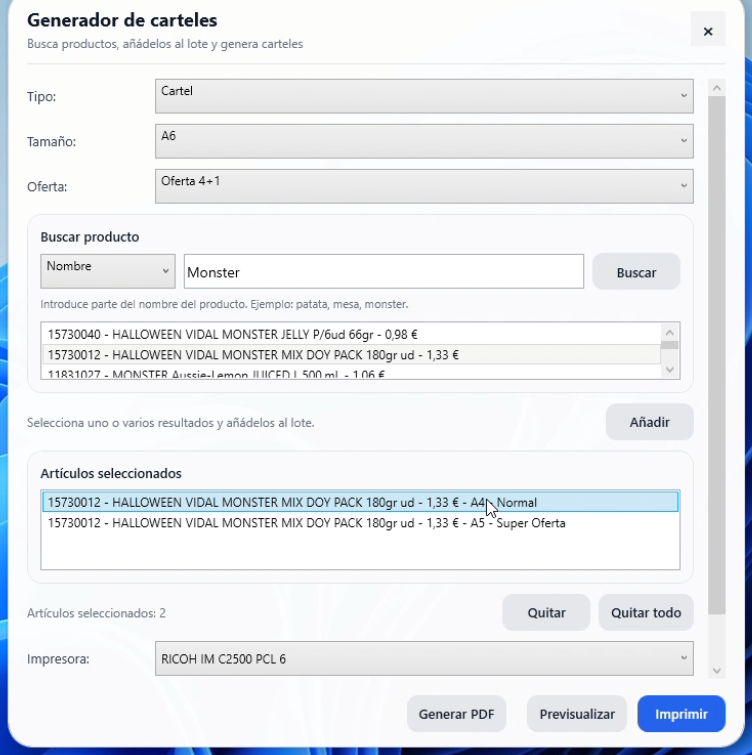
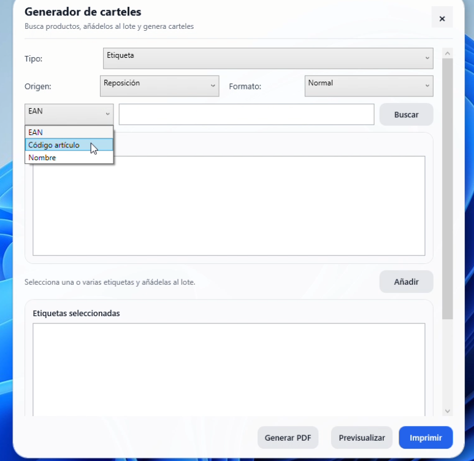
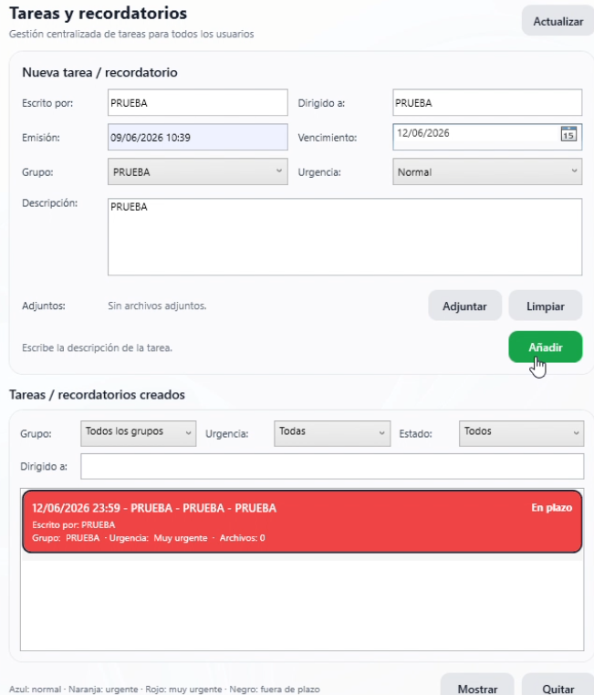

# Market OpsDesk

Aplicación empresarial diseñada para optimizar los procesos operativos de una pyme de distribución alimentaria. El sistema está compuesto por una aplicación de escritorio integrada con una API propia, desplegada inicialmente en un entorno Ubuntu Server.

---

## Características principales

### 🤖 Asistente IA

Asistente inteligente integrado capaz de responder consultas, asistir a los usuarios en tareas operativas y automatizar determinados procesos internos de la empresa, mejorando la productividad y reduciendo tiempos de gestión.

#### Captura

---

### 🖨️ Impresión rápida

Módulo diseñado para agilizar las tareas de impresión más frecuentes, permitiendo generar documentos de forma inmediata mediante accesos simplificados y procesos automatizados.

#### Captura

---

### 🏷️ Gestión de carteles y etiquetas

Herramienta especializada para la creación, organización e impresión de carteles y etiquetas. Facilita la gestión documental y la identificación de productos dentro de la operativa diaria.

#### Captura

---

### 📋 Gestión de tareas y recordatorios

Sistema de planificación interna que permite crear tareas, establecer recordatorios y adjuntar archivos relacionados, facilitando el seguimiento y la coordinación del trabajo diario.

#### Captura

---

## Arquitectura

La solución está compuesta por los siguientes elementos:

* Aplicación de escritorio para los usuarios finales.
* API REST propia para la comunicación con los servicios.
* Base de datos relacional MySQL.
* Despliegue inicial sobre Ubuntu Server.
* Integración con servicios de inteligencia artificial.

### Diagrama de arquitectura

---

## Tecnologías utilizadas

* C#
* Xaml
* MySQL
* REST API
* Ubuntu Server
* Inteligencia Artificial

---

## Objetivo del proyecto

Centralizar y optimizar las operaciones diarias de una pyme de distribución alimentaria mediante herramientas de automatización, gestión documental, organización de tareas y asistencia inteligente.
